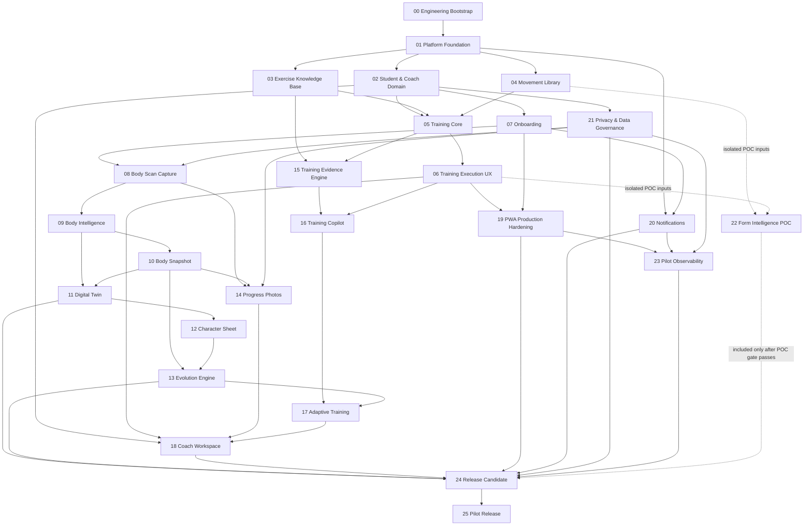

# Master Execution Plan

## Authority and target

This document is the authoritative capability roadmap from the completed engineering foundation to the **Fitness OS Pilot Release Candidate**. It is governed by the repository-level [Product Principles](../../PRODUCT_PRINCIPLES.md), the [PRD registry](../prds/PRD_REGISTRY.md), accepted ADRs, frozen contracts, and the autonomous delivery control-plane gates.

The roadmap is a dependency graph, not blanket implementation authorization. A node may begin only when:

1. its state is `APPROVED`;
2. every required dependency is `COMPLETED`;
3. its just-in-time detailed PRD satisfies [PRD governance](../prds/README.md); and
4. any required pre-flight, external, legal/privacy, human-perception, safety, credential, or financial gate is cleared.

`PROPOSED` means recorded for planning only. It does not authorize design, contracts, migrations, implementation, or release.

## Dependency DAG

The registry table is the canonical machine-readable-by-humans dependency list. This diagram is the equivalent overview; an arrow means the source is a required dependency of the destination.

PRD 22 is an isolated proof-of-concept lane. Its dotted relationship to PRD 24 is conditional: a failed or incomplete Form Intelligence POC does not block the baseline Pilot Release Candidate, but Form Intelligence must not enter that candidate unless the POC clears its explicitly approved technology, safety, privacy, and human-perception thresholds.

## Execution waves and safe parallelism

Concurrency is optional. The Orchestrator should use only isolated work and must freeze shared executable contracts before dependent Web, API, and Data work proceeds in parallel.

| Wave | Eligible work after dependencies complete | Safe parallelism and constraints |
| --- | --- | --- |
| 0 | 00 Engineering Bootstrap | Completed foundation; no additional work authorized by this row. |
| 1 | 01 Platform Foundation | Run as the shared prerequisite; contract and architecture decisions precede consumers. |
| 2 | 02 Student & Coach Domain; 03 Exercise Knowledge Base; 04 Movement Library | May proceed concurrently after 01 when contracts and ownership do not overlap. Their integration into 05 waits for all three. |
| 3 | 05 Training Core; 07 Onboarding; 21 Privacy & Data Governance | May proceed concurrently after their respective dependencies. Privacy/data governance must complete before body-image capture begins. |
| 4 | 06 Training Execution UX; 08 Body Scan Capture; 15 Training Evidence Engine; 20 Notifications | May proceed concurrently after their own dependencies and contract freezes. |
| 5 | 09 Body Intelligence; 19 PWA Production Hardening | May proceed concurrently. Body Intelligence requires its capability validation; PWA hardening must not absorb native scope. |
| 6 | 10 Body Snapshot; 16 Training Copilot | May proceed concurrently after their distinct dependency sets complete. Training Copilot remains evidence-grounded and human-in-the-loop. |
| 7 | 11 Digital Twin; 14 Progress Photos | May proceed concurrently after 10. Contracts, body data, and reviewers must remain isolated. |
| 8 | 12 Character Sheet | Starts after Digital Twin completes. |
| 9 | 13 Evolution Engine | Starts after Body Snapshot and Character Sheet complete. |
| 10 | 17 Adaptive Training; 23 Pilot Observability | May proceed concurrently after their distinct dependency sets complete. Adaptive changes remain subject to professional approval where consequential. |
| 11 | 18 Coach Workspace | Integrates prior student, training, progress, and adaptive capabilities; treat this as an integration-heavy wave. |
| POC | 22 Form Intelligence POC | May run as an isolated research/POC lane after 04 and 06. It must not alter production behavior, production contracts, or release scope before its gate passes. |
| 12 | 24 Release Candidate | Integration and release-gate work only after every unconditional dependency completes. Form Intelligence is conditional as described above. |
| 13 | 25 Pilot Release | Requires PRD 24 completion plus the separately authorized pilot release decision and gates. |

Wave placement describes dependency-safe opportunity, not an obligation to maximize agent count and not an approval of any PRD.

## Isolated research and POC lanes

Research may run ahead of runtime implementation only when separately authorized and when its outputs are non-production artifacts such as evidence notes, benchmarks, disposable prototypes, or validation reports. Such work:

- does not change runtime code, frozen contracts, migrations, production data, or user-visible behavior;
- does not silently select a paid provider or create a financial commitment;
- does not process private body, biometric-like, or health/fitness data without the required privacy and consent decisions;
- cannot mark a capability PRD complete or weaken its acceptance criteria;
- must keep providers behind adapters and distinguish measured values from estimates; and
- must stop on technology-validation failure, safety-critical uncertainty, or required human perception.

Candidate isolated lanes include Body Intelligence repeatability research before PRD 09, Digital Twin fidelity/provider research before PRD 11, Training Evidence source evaluation before PRD 15, and the explicitly registered Form Intelligence POC in PRD 22. Findings feed the relevant just-in-time PRD or technical design; they do not authorize implementation.

## Pilot Release Candidate target

PRD 24 targets the **Fitness OS Pilot Release Candidate**. Its conceptual product boundary includes the PWA, student and coach experiences, exercise knowledge, movement guidance, training core, onboarding, Body Scan, Body Intelligence, snapshots, Digital Twin, Character Sheet, evolution, progress photos, the evidence engine, Training Copilot, production PWA hardening, privacy controls, and pilot observability.

Form Intelligence is included only if PRD 22 passes its POC gate and a later approved PRD explicitly integrates the validated scope. Native iOS and Apple Watch applications are excluded from the Pilot V1 target; they require a future explicit product reason, PRD, and authorization consistent with PWA-first delivery.

The release status must remain evidence-based: report known findings and gate results. Never claim that the release is “100% bug-free,” perfectly secure, or incapable of production defects.
